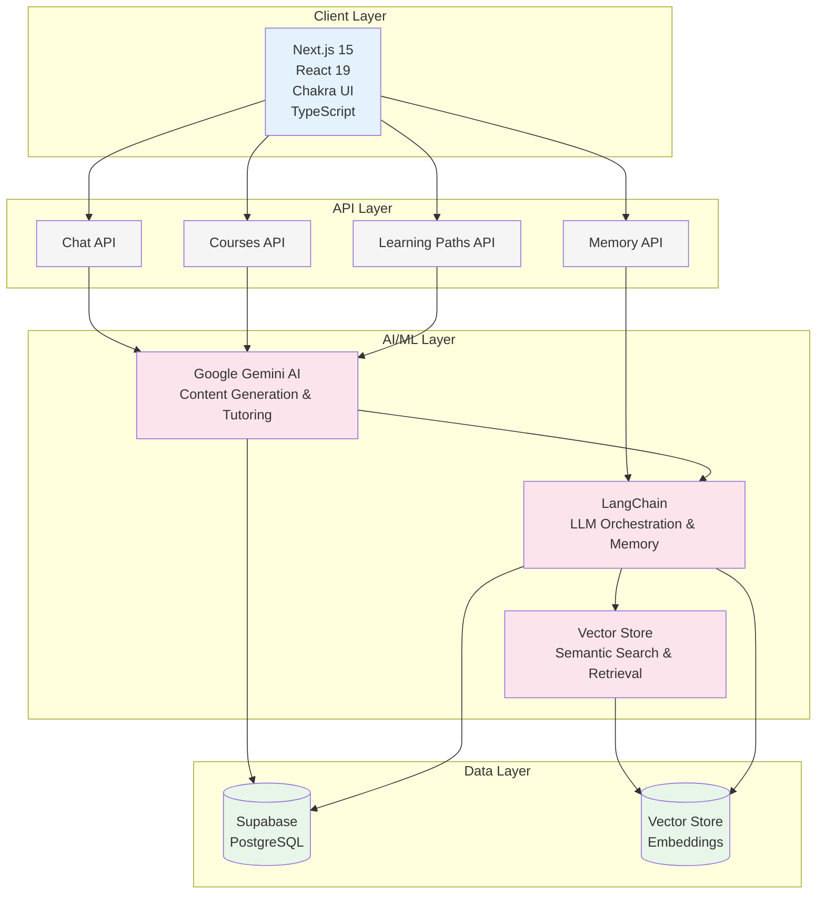

# Tutor360 - AI-Powered Learning Platform

<div align="center">

**An Intelligent, Adaptive Learning System Powered by Advanced AI**

[](https://nextjs.org/)
[](https://www.typescriptlang.org/)
[](https://deepmind.google/technologies/gemini/)
[](LICENSE)

</div>

---

## 📋 Executive Summary

**Tutor360** is an innovative AI-powered learning platform that revolutionizes personalized education through intelligent content generation, adaptive guidance, and persistent memory systems. Unlike traditional one-size-fits-all educational approaches, Tutor360 leverages advanced AI (Google Gemini) and semantic vector search to create truly personalized learning experiences that adapt in real-time to each learner's unique goals, learning style, and progress.

### Key Highlights

- 🎯 **Goal-Oriented Learning**: AI generates personalized learning paths based on user goals and skill gaps
- 🧠 **Persistent Memory System**: Long-term and short-term memory ensures continuity across learning sessions
- 🔄 **Real-Time Adaptation**: Dynamic content and assessment adjustment based on learner performance
- 📊 **Intelligent Analytics**: Continuous progress tracking, skill development monitoring, and gap analysis
- 🌐 **Multi-Subject Support**: Single platform for learning across all subjects with consistent AI guidance

---

## 📑 Table of Contents

- [Problem Statement](#-problem-statement)
- [Solution Overview](#-solution-overview)
- [Key Innovations](#-key-innovations)
- [Technical Architecture](#-technical-architecture)
- [Tech Stack](#️-tech-stack)
- [AI/ML Components](#-aiml-components)
- [Features](#-features)
- [Impact & Benefits](#-impact--benefits)
- [Competitive Advantages](#-competitive-advantages)
- [Quick Start](#-quick-start)
- [Installation](#-installation)
- [Project Structure](#-project-structure)
- [API Documentation](#-api-documentation)
- [Usage Examples](#-usage-examples)
- [Memory System](#-memory-system)
- [Performance & Scalability](#-performance--scalability)
- [Future Roadmap](#-future-roadmap)
- [Development](#-development)
- [Support](#-support)

## 🎯 Problem Statement

Traditional education systems face critical limitations:

1. **One-Size-Fits-All Approach**: Standardized curricula fail to accommodate individual learning styles, paces, and goals
2. **Lack of Personalization**: Static content cannot adapt to learner needs or provide contextual feedback
3. **No Learning Continuity**: Traditional systems don't remember past interactions, requiring learners to repeat context
4. **Limited Subject Coverage**: Most platforms specialize in specific subjects, fragmenting the learning experience
5. **Inefficient Skill Gap Identification**: Manual assessment processes delay targeted intervention

**The Challenge**: How can we create a truly personalized, adaptive learning system that understands each learner's unique needs and provides continuous, context-aware guidance across all subjects?

## 💡 Solution Overview

Tutor360 addresses these challenges through an AI-powered platform that combines:

- **Intelligent Content Generation**: AI creates personalized courses, lessons, and topics based on user goals and identified skill gaps
- **Adaptive Learning Engine**: Real-time adaptation of content difficulty, pace, and teaching style based on learner performance
- **Persistent Memory Architecture**: Dual-layer memory system (short-term and long-term) ensures learning continuity and context preservation
- **Semantic Search & Retrieval**: Vector-based memory search enables contextually relevant content and feedback
- **Multi-Subject Intelligence**: Single AI tutor capable of teaching across all subjects with consistent quality

## 🚀 Key Innovations

### 1. **Goal-Oriented Learning Path Generation**

- AI analyzes user goals and current skill levels
- Automatically generates structured learning paths with courses, lessons, and topics
- Continuously adapts path based on progress and performance

### 2. **Dual-Layer Memory System**

- **Short-term Memory**: Real-time conversation context for immediate continuity
- **Long-term Memory**: Persistent storage of important learnings across all sessions
- **Vector Search Integration**: Semantic similarity search for relevant memory retrieval
- **Memory Preservation**: Long-term memories persist even when conversations are deleted

### 3. **Real-Time Adaptive Assessment**

- Dynamic assessment generation based on learner performance
- Skill gap identification and targeted content creation
- Progressive difficulty adjustment
- Performance-based advancement gates

### 4. **Intelligent Content Summarization**

- Automatic summarization of course progress every 20 messages
- Learning history compression for efficient memory usage
- Context-aware memory recall for personalized guidance

### 5. **Semantic Memory Retrieval**

- Vector embeddings for all memories
- Similarity-based retrieval for contextually relevant information
- Fallback to text-based search when vectors unavailable

## 🏗️ Technical Architecture



## 🛠️ Tech Stack

### Frontend

- **Framework**: Next.js 15.2.4 (App Router)
- **UI Library**: Chakra UI 3.8.1
- **Language**: TypeScript 5.7.3
- **Styling**: Emotion, CSS Modules
- **Markdown**: react-markdown with remark plugins
- **Syntax Highlighting**: react-syntax-highlighter

### Backend

- **Runtime**: Node.js
- **API**: Next.js API Routes
- **Authentication**: Supabase Auth
- **Database**: Supabase (PostgreSQL)

### AI & ML

- **AI Model**: Google Gemini (via @google/generative-ai)
- **LLM Framework**: LangChain 0.3.19
- **Vector Store**: Supabase Vector Store (via @langchain/community)
- **Embeddings**: Google Generative AI embeddings

### Additional Tools

- **Web Scraping**: Cheerio, Playwright
- **Search**: Serper API
- **State Management**: React Hooks

## 🤖 AI/ML Components

### Core AI Technologies

1. **Google Gemini AI**

   - **Purpose**: Content generation, conversational tutoring, adaptive guidance
   - **Integration**: Direct API integration with streaming responses
   - **Capabilities**: Multi-modal understanding, context-aware responses

2. **LangChain Framework**

   - **Purpose**: LLM orchestration, memory management, chain composition
   - **Features**: Conversation history management, prompt engineering, tool integration

3. **Vector Embeddings & Search**
   - **Model**: Google Generative AI embeddings
   - **Storage**: Supabase Vector Store
   - **Use Cases**: Memory retrieval, content similarity, context matching

### AI Workflow

1. **Learning Path Generation**

   ```
   User Goal + Skill Profile → AI Analysis → Personalized Learning Path
   ```

2. **Content Adaptation**

   ```
   Learner Performance → AI Assessment → Content Difficulty Adjustment
   ```

3. **Memory Management**
   ```
   Conversation → Summarization → Vector Embedding → Storage → Retrieval
   ```

## 📖 Typical Use Case

A user creates a learning path by choosing a subject and setting a goal. The system retrieves their skill records, identifies gaps, and generates courses, lessons, and topics tailored to bridge those gaps. As the learner engages, the AI monitors interactions, summarizes progress, updates skills, and generates assessments that must be passed to advance. Over time, the platform adapts to their progress, reinforces strengths, addresses weaknesses, and provides personalized guidance.

## 🎬 Demo & Screenshots

> **Note**: Screenshots or demo videos comming soon.
>
> - Learning path creation interface
> - AI tutor conversation interface
> - Progress tracking dashboard
> - Memory management interface
> - Assessment generation examples

**Live Demo**: []

## 🚀 Features

### Personalized Learning

- **Goal-Oriented Learning Paths**: Create customized learning paths based on user goals and current skill levels
- **Adaptive Content Generation**: AI generates courses, lessons, and topics tailored to bridge knowledge gaps
- **Personalized Guidance**: Conversational AI tutor that adapts teaching style to match individual learning preferences
- **Skill Gap Analysis**: Automatically identifies learning gaps and generates targeted content to address them

### Intelligent Memory & Context

- **Long-Term Memory System**: Persistent memory that remembers important information across all learning sessions
- **Short-Term Context**: Real-time conversation history with course context for seamless learning continuity
- **Vector Search**: Semantic search for finding relevant memories and learning content
- **Memory Preservation**: Long-term memories persist even when conversations are deleted, ensuring no learning progress is lost
- **Progress Summarization**: Automatic summarization of course progress and learning history

### Real-Time Adaptation

- **Dynamic Lesson Adaptation**: Lessons and topics adapt in real-time based on learner performance
- **Real-Time Feedback**: Instant feedback on learner interactions and responses
- **Streaming Responses**: Real-time streaming of AI responses for immediate engagement
- **Performance Monitoring**: Continuous analysis of learner performance and interaction patterns

### Assessment & Progress Tracking

- **Structured Assessments**: AI-generated assessments that must be passed to advance
- **Skill Development Tracking**: Tracks skill development and updates learner profiles
- **Progress Reinforcement**: Adapts to reinforce strengths and address weaknesses
- **Goal Achievement**: Monitors progress toward learning goals and adjusts accordingly

### Additional Capabilities

- **Web Search Integration**: Real-time web search using Serper API for up-to-date information
- **Multi-Subject Support**: Learn across potentially all subjects with the same intelligent tutor
- **Secure Authentication**: Secure user authentication and authorization with Supabase

## 🚀 Quick Start

Get Tutor360 up and running in minutes:

```bash
# Clone the repository
git clone https://github.com/ThomasLix7/mindpulse.git
cd mindpulse

# Install dependencies
npm install

# Set up environment variables (see Installation section)
cp .env.example .env.local  # Edit with your credentials

# Run the development server
npm run dev
```

Visit [http://localhost:3000](http://localhost:3000) to see Tutor360 in action.

## 📋 Prerequisites

Before you begin, ensure you have the following:

- **Node.js** v18 or higher ([download](https://nodejs.org/))
- **npm** v9 or higher (comes with Node.js, or use yarn/pnpm/bun)
- **Supabase account** ([sign up here](https://supabase.com))
- **Google Gemini API key** ([get it here](https://makersuite.google.com/app/apikey))
- **Serper API key** (optional, for web search - [get it here](https://serper.dev))

## 🔧 Installation

1. **Clone the repository**

   ```bash
   git clone https://github.com/ThomasLix7/mindpulse.git
   cd mindpulse
   ```

2. **Install dependencies**

   ```bash
   npm install
   # or
   yarn install
   # or
   pnpm install
   ```

3. **Set up environment variables**

   Create a `.env.local` file in the root directory:

   ```env
   # Supabase Configuration
   NEXT_PUBLIC_SUPABASE_URL=your_supabase_project_url
   NEXT_PUBLIC_SUPABASE_ANON_KEY=your_supabase_anon_key

   # Google Gemini API
   GOOGLE_API_KEY=your_google_gemini_api_key

   # Serper API (Optional - for web search)
   SERPER_API_KEY=your_serper_api_key
   ```

4. **Set up the database**

   Run the Supabase migrations:

   ```bash
   # If using Supabase CLI
   supabase db push
   ```

   Or manually run the SQL migrations from `supabase/migrations/`:

   - `20251028054241_core_setting.sql`
   - `20251028055941_learning_contents.sql`
   - `20251028060147_memory_system.sql`

5. **Run the development server**

   ```bash
   npm run dev
   # or
   yarn dev
   # or
   pnpm dev
   ```

6. **Open your browser**

   Navigate to [http://localhost:3000](http://localhost:3000)

## 📁 Project Structure

```
tutor360/
├── app/                          # Next.js App Router
│   ├── api/                      # API Routes
│   │   ├── chat/                 # Chat API endpoint
│   │   ├── courses/              # Course management API
│   │   ├── learning-paths/       # Learning path API
│   │   └── memory/               # Memory management API
│   ├── login/                    # Login page
│   ├── signup/                   # Signup page
│   ├── mentor/                   # Main mentor interface
│   │   ├── [id]/                 # Dynamic course pages
│   │   └── layout.tsx            # Mentor layout
│   ├── longterm-memories/        # Long-term memories page
│   ├── layout.tsx                # Root layout
│   ├── page.tsx                  # Home page
│   └── providers.tsx             # Context providers
├── components/                   # React components
│   ├── auth/                     # Authentication components
│   ├── chat/                     # Chat interface components
│   ├── ui/                       # UI primitives
│   └── Mentor.tsx                # Main mentor component
├── hooks/                        # Custom React hooks
│   ├── useChat.ts                # Chat functionality hook
│   ├── useConversations.ts       # Conversation management
│   └── useMemory.ts              # Memory operations
├── lib/                          # Library code
│   ├── gemini.ts                 # Gemini AI configuration
│   ├── vectorstore.ts            # Vector store setup
│   └── theme.ts                  # Theme configuration
├── utils/                        # Utility functions
│   ├── memory/                   # Memory utilities
│   │   ├── index.ts              # Memory exports
│   │   ├── recall.ts             # Memory recall functions
│   │   ├── save.ts               # Memory save functions
│   │   └── summary.ts            # Memory summarization
│   ├── supabase-client.ts        # Supabase client (client-side)
│   ├── supabase-server.ts        # Supabase client (server-side)
│   └── api-fetch.ts              # API fetch wrapper
├── tools/                        # External tools
│   └── webSearch.ts              # Web search integration
├── types/                        # TypeScript type definitions
├── supabase/                     # Supabase configuration
│   └── migrations/               # Database migrations
└── public/                       # Static assets
```

## 🔌 API Documentation

### Chat API

**Endpoint**: `POST /api/chat`

Send messages to the AI tutor and receive streaming responses.

**Request Body**:

```typescript
{
  message: string;           // User message or "__GREETING__" or "__CONTINUE__"
  courseId: string;           // Course ID
  userId: string;             // User ID
  enableWebSearch?: boolean;  // Enable web search (default: true)
}
```

**Headers**:

```
Authorization: Bearer <access_token>
Content-Type: application/json
```

**Response**: Server-Sent Events (SSE) stream

**Example**:

```typescript
const response = await fetch("/api/chat", {
  method: "POST",
  headers: {
    "Content-Type": "application/json",
    Authorization: `Bearer ${accessToken}`,
  },
  body: JSON.stringify({
    message: "Explain React hooks",
    courseId: "course-123",
    userId: "user-456",
    enableWebSearch: true,
  }),
});

// Handle streaming response
const reader = response.body?.getReader();
// ... process stream
```

### Memory API

**Endpoint**: `POST /api/memory`

Save or promote memories to long-term storage.

**Request Body** (Create new memory):

```typescript
{
  userId: string;
  userMessage: string;
  aiResponse: string;
}
```

**Request Body** (Promote existing memory):

```typescript
{
  userId: string;
  memoryId: string;
}
```

**Example**:

```typescript
// Create new long-term memory
await fetch("/api/memory", {
  method: "POST",
  headers: {
    "Content-Type": "application/json",
    Authorization: `Bearer ${accessToken}`,
  },
  body: JSON.stringify({
    userId: "user-123",
    userMessage: "What's the capital of France?",
    aiResponse: "The capital of France is Paris.",
  }),
});

// Promote existing memory
await fetch("/api/memory", {
  method: "POST",
  headers: {
    "Content-Type": "application/json",
    Authorization: `Bearer ${accessToken}`,
  },
  body: JSON.stringify({
    userId: "user-123",
    memoryId: "memory-456",
  }),
});
```

**Endpoint**: `GET /api/memory`

Retrieve long-term memories for a user.

**Query Parameters**:

- `userId` (required): User ID

**Example**:

```typescript
const response = await fetch(`/api/memory?userId=${userId}`, {
  headers: {
    Authorization: `Bearer ${accessToken}`,
  },
});
const memories = await response.json();
```

**Endpoint**: `DELETE /api/memory`

Delete a long-term memory.

**Query Parameters**:

- `memoryId` (required): Memory ID
- `userId` (required): User ID

### Courses API

**Endpoint**: `GET /api/courses`

Get courses for a user.

**Query Parameters**:

- `userId` (required): User ID
- `courseId` (optional): Specific course ID

**Headers**:

```
Authorization: Bearer <access_token>
```

**Example**:

```typescript
const response = await fetch(`/api/courses?userId=${userId}`, {
  headers: {
    Authorization: `Bearer ${accessToken}`,
  },
});
const courses = await response.json();
```

**Endpoint**: `POST /api/courses`

Create a new course.

**Request Body**:

```typescript
{
  userId: string;
  title: string;
  description?: string;
  curriculum?: object;
  learning_path_id?: string;
}
```

**Endpoint**: `DELETE /api/courses`

Delete a course.

**Query Parameters**:

- `courseId` (required): Course ID
- `userId` (required): User ID

### Learning Paths API

**Endpoint**: `GET /api/learning-paths`

Get learning paths for a user.

**Query Parameters**:

- `userId` (required): User ID
- `learningPathId` (optional): Specific learning path ID

**Headers**:

```
Authorization: Bearer <access_token>
```

**Example**:

```typescript
const response = await fetch(`/api/learning-paths?userId=${userId}`, {
  headers: {
    Authorization: `Bearer ${accessToken}`,
  },
});
const learningPaths = await response.json();
```

## 💡 Usage Examples

### Creating a Learning Path

```typescript
const learningPath = {
  title: "Full Stack Web Development",
  goal: "Learn to build modern web applications",
  courses: [
    {
      title: "Introduction to HTML & CSS",
      description: "Learn the fundamentals of web markup",
      curriculum: {
        lessons: [
          {
            title: "HTML Basics",
            description: "Introduction to HTML",
            topics: ["Elements", "Attributes", "Structure"],
          },
        ],
      },
    },
  ],
};
```

### Using Memory Functions

```typescript
import { saveToLongTermMemory, recallLongTermMemory } from "@/utils/memory";

// Save a memory
await saveToLongTermMemory(userId, {
  userMessage: "I prefer learning through examples",
  aiResponse: "I'll use more examples in my explanations.",
});

// Recall memories
const memories = await recallLongTermMemory(
  courseId,
  query,
  userId,
  accessToken
);
```

### Custom Hooks

```typescript
import { useChat } from "@/hooks/useChat";
import { useConversations } from "@/hooks/useConversations";

// Use chat hook
const { input, setInput, loading, handleSubmit } = useChat({
  courses,
  setCourses,
  activeCourseId,
  user,
  // ... other props
});

// Use conversations hook
const { courses, createNewCourse, getActiveCourse } = useConversations(
  courseId,
  isHomePage
);
```

## 🧪 Development

### Available Scripts

```bash
# Start development server
npm run dev

# Build for production
npm run build

# Start production server
npm start

# Lint code
npm run lint
```

### Code Style

The project uses ESLint with Next.js configuration. Follow the existing code style and run `npm run lint` before committing.

### Environment Variables

All environment variables should be prefixed with `NEXT_PUBLIC_` for client-side access. Server-side only variables don't need this prefix.

### Troubleshooting

**Common Issues:**

- **Port already in use**: Change the port by running `npm run dev -- -p 3001`
- **Database connection errors**: Verify your Supabase credentials in `.env.local`
- **API key errors**: Ensure your Google Gemini API key is valid and has proper permissions
- **Memory issues**: Check that your Supabase project has the vector extension enabled

## 🧠 Memory System

### Architecture

Tutor360 implements a sophisticated dual-layer memory system:

1. **Short-term Memory**: Conversations are stored in the `course_messages` table
2. **Memory Summarization**: After every 20 messages, conversations are automatically summarized
3. **Long-term Memory**: Important memories can be promoted to long-term storage
4. **Vector Search**: Memories are embedded using Google Generative AI embeddings and stored in Supabase Vector Store
5. **Memory Recall**: Relevant memories are retrieved based on semantic similarity and context

### Memory Preservation

Long-term memories are preserved even when conversations are deleted:

- Foreign key constraint uses `ON DELETE SET NULL` instead of `CASCADE`
- Long-term memories have their `conversation_id` set to `NULL` when conversation is deleted
- Memory recall functions retrieve memories regardless of conversation association
- Ensures learning progress is never lost

### Memory Retrieval Strategy

1. **Vector Search** (Primary): Semantic similarity search using embeddings
2. **Text Search** (Fallback): Keyword-based search when vectors unavailable
3. **Context Filtering**: Results filtered by course and user context

## 📊 Impact & Benefits

### For Learners

- **Personalized Experience**: Every learning path is tailored to individual goals and skills
- **Continuous Progress**: Memory system ensures no learning is forgotten
- **Adaptive Pace**: Content adjusts to optimal learning speed
- **Multi-Subject Learning**: Single platform for all learning needs

### For Educators

- **Automated Content Generation**: AI creates structured learning materials
- **Progress Tracking**: Comprehensive analytics on learner performance
- **Gap Identification**: Automatic detection of learning gaps
- **Scalable Solution**: One platform serves unlimited learners

### Technical Impact

- **Efficient Memory Usage**: Summarization reduces storage requirements
- **Fast Retrieval**: Vector search enables sub-second memory recall
- **Scalable Architecture**: Handles growing user base and content
- **Real-Time Adaptation**: Immediate response to learner needs

## 🏆 Competitive Advantages

1. **True Personalization**: Not just recommendations, but AI-generated content tailored to each learner
2. **Persistent Memory**: Unlike chat-based systems, Tutor360 remembers across sessions
3. **Multi-Subject Intelligence**: Single AI tutor for all subjects vs. specialized platforms
4. **Goal-Oriented Design**: Focus on achieving specific learning goals, not just content delivery
5. **Real-Time Adaptation**: Dynamic content adjustment based on performance, not pre-set paths
6. **Semantic Understanding**: Vector search enables contextually relevant memory retrieval

## ⚡ Performance & Scalability

### Current Capabilities

- **Response Time**: < 2s for AI responses (streaming)
- **Memory Retrieval**: < 500ms for vector search
- **Database**: Optimized queries with proper indexing

### Scalability Features

- **Caching**: Memory cache for frequently accessed data (5-minute TTL)
- **Streaming**: Server-Sent Events for real-time responses
- **Vector Store**: Efficient similarity search with Supabase
- **Database Optimization**: Connection pooling and query optimization

## 🗺️ Future Roadmap

### Short-term (3-6 months)

- Multi-language support
- Advanced analytics dashboard
- Mobile app (React Native)
- Integration with more AI models
- Enhanced assessment types (coding challenges, projects)

### Medium-term (6-12 months)

- Collaborative learning features
- Peer-to-peer tutoring integration
- Advanced visualization of learning paths
- API for third-party integrations
- White-label solution for institutions

### Long-term (12+ months)

- Multi-modal learning (video, audio, interactive)
- AR/VR integration for immersive learning
- Advanced AI model fine-tuning
- Global learning community features
- Enterprise-grade security and compliance

## 📝 License

This project is licensed under the MIT License - see the [LICENSE](LICENSE) file for details.

## 🆘 Support

- **Issues**: [GitHub Issues](https://github.com/ThomasLix7/mindpulse/issues)
- **Discussions**: [GitHub Discussions](https://github.com/ThomasLix7/mindpulse/discussions)
- **Email**: hongtao.li@uni-leipzig.de

## 🙏 Acknowledgments

- [Next.js](https://nextjs.org) for the amazing framework
- [Chakra UI](https://chakra-ui.com) for the component library
- [Google Gemini](https://deepmind.google/technologies/gemini/) for AI capabilities
- [Supabase](https://supabase.com) for backend infrastructure
- [LangChain](https://langchain.com) for LLM orchestration

---

<div align="center">

**为爱发电**

Made with ❤️ for the future of personalized education

</div>
